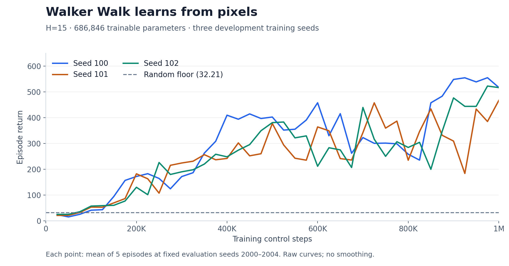
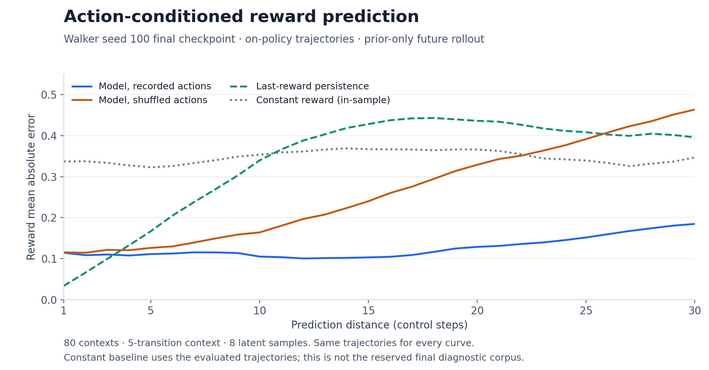

# DreamerV3 — Reduced-Scale PyTorch Reimplementation

An independent, reduced-scale **DreamerV3 reimplementation in PyTorch**, trained from **64×64 RGB pixels on DM Control**. On Walker Walk, the seed-100 agent improves return from **about 30 to about 540 over 1 million control steps**, using **roughly 0.7M trainable parameters versus the paper's 12M visual-control model**. The agent learns an action-conditioned world model and trains its policy through latent imagination; the results demonstrate these learning mechanisms at a smaller scale, without establishing parity with published DreamerV3 performance.

## Results



The headline compares the **first five and last five evaluation means** of seed 100: **29.6 → 542.7**. Curves show unsmoothed means over five episodes at fixed evaluation seeds 2000–2004, with mean-action evaluation. The table below separately reports **20-episode evaluations of the final checkpoint**, using seeds 3000–3019 where available.

| Task / policy | Training seed | Final 20-episode return | Training control steps | GPU-hours | Peak GPU memory |
|---|---:|---:|---:|---:|---:|
| Walker Walk, H=15 | 100 | 539.50 ± 42.80 | 1,000,000 | 5.610† | 1,999.3 MiB |
| Walker Walk, H=15 | 101 | Not measured | 1,000,000 | 5.036 | 1,999.3 MiB |
| Walker Walk, H=15 | 102 | Not measured | 1,000,000 | 5.008 | 1,999.3 MiB |
| Walker Walk, uniform random | — | 32.50 ± 3.64 | 0 (no training) | — | — |

**± is episode standard deviation, not variation across training seeds.** The random policy uses the same evaluation initial conditions as the trained seed-100 checkpoint; the plot's independently measured random floor is **32.21**. GPU-hours are elapsed run hours on one RTX PRO 4000, including periodic evaluation and checkpointing. †Seed 100 shared the GPU with another run; seeds 101 and 102 ran alone. Memory is peak PyTorch allocation, not total device reservation.

Seeds 101 and 102 have final **five-episode** returns of **466.90 ± 222.55** and **516.58 ± 38.69**, respectively. Both reproduce learning above random, but seed 101 remains unreliable. Their 20-episode evaluations are pending.



The seed-100 final world model predicts future rewards from recorded actions without future images. At distance 30, shuffling actions raises reward MAE from **0.185 to 0.463**, showing action sensitivity on these trajectories. This diagnostic uses **80 contexts and 8 latent samples** from on-policy evaluation data; its constant-reward baseline is fitted to those same trajectories.

Both figures, the table, and the numerical summaries above regenerate with [`scripts/plot_results.py`](scripts/plot_results.py). Sources: [pilot artifacts](results/m9/pilot/), [confirmation artifacts](results/m9/confirmation/), [matched control report](results/m9/controls/controls-report-walker-2026-09-20.json), and [random-floor measurements](results/m1/random-floor-walker-2026-09-20.json). The script also writes a summary with source-file hashes.

## What is implemented

- **Recurrent state-space model:** categorical latents, an eight-block recurrent cell, posterior inference, and prior dynamics — [`rssm.py`](src/dreamer/rssm.py).
- **Prediction heads and world-model objective:** image reconstruction, reward and continuation prediction, two-hot targets, and balanced KL losses — [`world_model.py`](src/dreamer/world_model.py), [`heads.py`](src/dreamer/heads.py), [`twohot.py`](src/dreamer/twohot.py).
- **Latent imagination:** prior-only rollouts from replay states, with no simulator calls or future observations — [`imagine.py`](src/dreamer/imagine.py).
- **Actor–critic learning:** REINFORCE, return normalization, entropy regularization, bootstrapped λ-returns, slow-critic regularization, and a replay critic — [`actor.py`](src/dreamer/actor.py), [`critic.py`](src/dreamer/critic.py).
- **Environment interaction and replay:** pixel collection, episode-safe sequence sampling, burn-in, and update scheduling — [`env.py`](src/dreamer/env.py), [`replay.py`](src/dreamer/replay.py), [`training.py`](src/dreamer/training.py).
- **Isolated evaluation:** separate simulators and random streams, with training-state checks — [`evaluation.py`](src/dreamer/evaluation.py).
- **Checkpoint/resume:** model, optimizer, replay, counters, and RNG state — [`checkpoint.py`](src/dreamer/checkpoint.py).

## Differences from the paper

The target is [arXiv:2301.04104v2](https://arxiv.org/abs/2301.04104v2). Paper settings below refer to its visual-control protocol unless noted.

| Aspect | Paper | This repo |
|---|---|---|
| Model size | 12M parameters for visual control; 12M–400M evaluated overall | 686,846 trainable parameters for Walker |
| Action repeat | 2 | 1; one policy decision per control step |
| Training budget | 1M environment steps for visual control | 1M control steps for Walker; 500K for Cartpole |
| Task coverage | 20 visual-control tasks, plus other domains | Walker Walk and Cartpole Swingup |
| Parallel environments | 16 for visual control | 1 |
| Replay ratio | 512 in the visual-control protocol | 64 loss-bearing replay positions per collected transition |
| Optimizer β₂ | 0.99 | 0.999, following the pinned author implementation |

Sources: paper Tables 2–4 and the [full specification and deviation register](docs/spec.md). Replay-ratio conventions account differently for action repeat and context; see the [unit reconciliation](docs/config.md) before comparing update counts.

Additional differences from the **pinned author code** are PyTorch eager FP32 execution instead of JAX/bfloat16, a 500K-transition replay buffer instead of 5M, and a recomputed five-transition burn-in instead of stored replay latents. The later author code uses a visual replay ratio of 256. Walker's buffer evicts older episodes during training. These settings and the reduced capacity limit direct comparisons with published returns.

## Quickstart

The recorded environment is Linux with an NVIDIA GPU, headless EGL rendering, **Python 3.12.11**, and **PyTorch 2.13.0+cu129**. Install Python and `uv` first; the commands below assume `python3.12` selects that interpreter.

```bash
git clone https://github.com/sathviknookala/dreamerV3-reproduction.git
cd dreamerV3-reproduction
uv venv --python "$(command -v python3.12)" --seed .venv
.venv/bin/python -m pip install torch==2.13.0 --index-url https://download.pytorch.org/whl/cu129
.venv/bin/python -m pip install -r requirements.txt
.venv/bin/python -m pip install matplotlib==3.10.6
export MUJOCO_GL=egl
```

Train Walker with the recorded development configuration:

```bash
PYTHONPATH=src .venv/bin/python scripts/m9_train.py --config configs/walker-h15-frozen.json --task walker --seed 100 --device cuda --out runs/walker-h15-s100
```

Pass `--task walker` explicitly: the current command-line default otherwise overrides the task in the config. Use a fresh output directory for each run. The file preserves the measured Walker settings; the final experiment configuration remains unqualified.

Evaluate the resulting final checkpoint on 20 episodes, alongside matched controls and open-loop diagnostics:

```bash
PYTHONPATH=src .venv/bin/python scripts/m9_controls.py --task walker --checkpoint runs/walker-h15-s100/model-final.pt --episodes 20 --seed-base 3000 --device cuda --out runs/walker-h15-s100-controls
```

Regenerate the README figures and table from the archived results, without training or a GPU:

```bash
.venv/bin/python scripts/plot_results.py
```

**Checkpoint availability:** trained weights are currently retained in the ignored `runs/` directory and are not published with the repository. Committed logs reproduce the figures; independent checkpoint evaluation requires training a model or obtaining the recorded weights. A final checkpoint alone cannot reconstruct the historical learning curve. Publishing compact checkpoints with hashes is an outstanding reproducibility item.

## Repository layout

```text
configs/       Recorded development configurations
docs/          Algorithm specification, deviations, validation, and experiment design
src/dreamer/   PyTorch agent, world model, replay, and training infrastructure
scripts/       Training, evaluation, validation, and figure generation
tests/         Component and integration unit tests
results/       Committed measurements, logs, manifests, and generated figures
runs/          Local checkpoints and generated run output; ignored by Git
```

## Testing and validation

The recorded suite has **249 unit tests**, with **75/75 integration checks on each task** and **22/22 online-loop mutations detected**. A separately trained Walker world model beats the training-set constant-reward predictor at every tested prediction distance from **1–30** on held-out episodes; its validation gate passes **26/26 checks**. Evidence: [integration results](results/m9/README.md), [held-out world-model validation](results/m5/README.md), and [test commands](CLAUDE.md).

```bash
PYTHONPATH=src:tests .venv/bin/python -m unittest test_env test_replay test_collector test_rssm test_world_model test_openloop test_optim test_imagine test_critic test_actor test_agent test_training test_checkpoint test_evaluation
```

Resume restores an identical next update in the recorded checks; long CUDA training trajectories are not guaranteed bitwise identical.

## Experiment status and roadmap

**Recorded status: September 21, 2026.** End-to-end visual-control learning is demonstrated, including three complete Walker development runs and matched policy controls. The reviewed snapshot documents no experiment still running.

### Known issues

- **Walker seed 101:** strong average learning, but unstable late performance and a near-random episode at the final checkpoint.
- **Cartpole Swingup:** beats random and zero-action controls, but does not consolidate its improvements; action-sensitive prediction needs testing on more varied trajectories.

### Remaining work

- Complete wider checkpoint evaluation for Walker seeds 101 and 102, diagnose reliability, and publish compact trained weights.
- Qualify and freeze the shared settings and a separate diagnostic corpus.
- Run the **designed, not yet executed horizon ablation**: Walker at H=5, 15, and 30, plus Cartpole at H=15, using training seeds 0–2 and 20 final evaluation episodes per run.
- Report return versus real data and elapsed time, prediction error versus distance, and all individual seed outcomes; add a matched author-implementation comparison if resources permit.

The current results establish learning at the measured scale. Horizon effects and published-performance parity remain untested. See the [experiment design](docs/experiment.md).

## Citation and acknowledgments

This project follows **Mastering Diverse Domains through World Models** by Danijar Hafner, Jurgis Pasukonis, Jimmy Ba, and Timothy Lillicrap, using the [2024 arXiv v2 specification](https://arxiv.org/abs/2301.04104v2).

```bibtex
@article{hafner2024dreamerv3,
  title   = {Mastering Diverse Domains through World Models},
  author  = {Hafner, Danijar and Pasukonis, Jurgis and Ba, Jimmy and Lillicrap, Timothy},
  journal = {arXiv preprint arXiv:2301.04104v2},
  year    = {2024},
  url     = {https://arxiv.org/abs/2301.04104v2}
}
```

The [authors' implementation at `e3f0224`](https://github.com/danijar/dreamerv3/tree/e3f02248693a79dc8b0ebd62c93683888ddaccfe) was consulted for architecture, configuration, and implementation details left ambiguous in the paper. Paper-to-code decisions and deviations are documented in [the specification](docs/spec.md). The agent is independently implemented in PyTorch; simulation and rendering use [DeepMind Control Suite](https://github.com/google-deepmind/dm_control) and [MuJoCo](https://github.com/google-deepmind/mujoco).
